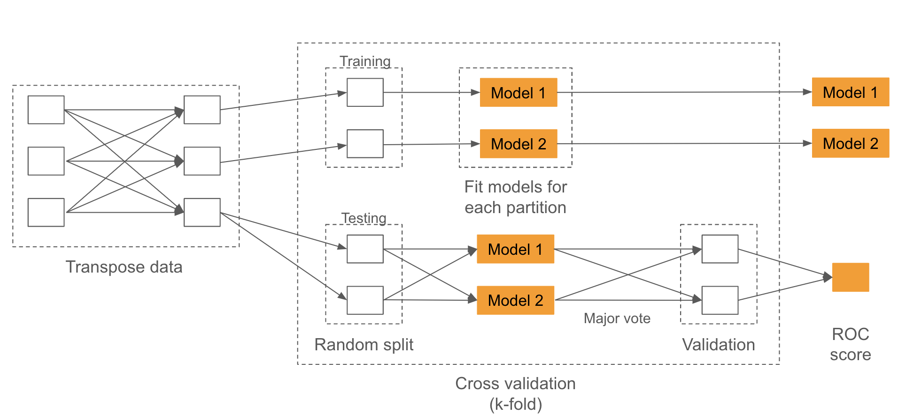

Alzheimer's Dementia
=============

- [Problem Description](#problem-description--)
- [Dataset](#dataset--)
- [Methodology (How to run the code and what every file does)](#methodology-how-to-run-the-code-and-what-every-file-does)
- [SizeUp and SpeedUp](#speed-up-and-size-up)
- [Results](#results)
- [Installation](#installation)

### Files to Run with order
- [1 OneHot Encoding File](./1_Fill_null_and_One_Hot_Encoding.ipynb)
- [2 Chi-Sqaure Test File](./2_Chi2_test_Feature_Selection.ipynb)
- [3 Model Development](./3_Model_Developement.ipynb)
- [4 Size up - Speed up - one hot encoding](./4_Size_up-Speed_up_one_hot_encoding.ipynb)
- [5 Size up - Speed up - chi-sqaure test](./5_size_up_speed_up_Chi2.ipynb)

## Problem Description - 

Alzheimer's disease (AD) is the primary cause of progressive cognitive decline in the elderly, accounting for 60-70\% of cases. The gradual onset of AD, combined with its intricate pathogenesis and symptom overlap with normal aging, makes accurate diagnosis challenging, underscoring the need for advanced diagnostic tools. Traditional genetic prediction methods, such as Polygenic Risk Scores, often fail to capture the complex genetic landscape of AD vulnerability. To tackle these challenges, our study utilized big data analytics to identify potential genetic biomarkers for AD. We analysed a dataset comprising 534 individuals, both AD patients and healthy controls, with 297,678 genetic variants.


## Dataset - 

Our dataset includes `534` individuals—both AD patients and healthy controls—
showcasing `297,678` genetic variants. Variants are the genotype of each
individual which can be any of three options per variant which translates into a 534 x 297,678 matrix for genotypes.

In the dataset, there are several key features, such as 'FID' which stands for `Family ID, 'IID'` representing Individual ID, `'PAT'` indicating Paternal ID, and `'MAT'` for Maternal ID. The feature `'SEX'` denotes the gender of the sample. The `PHENOTYPE` variable represents the phenotypic status of individuals, typically categorized as "0" for the control group (without the disease or characteristic) and "1" for the case group (with the disease), where the disease under study is dementia. The remaining features are gene loci. For example, a typical SNP's feature name is `rs3131972_A`. A tpyical dataset entity shows in Table

| Attribute | Value   | 
| :---:   | :---: | 
| FID | 201023670019\_R01C01   |
| IID | BB001 |
| PAT | 0 |
| MAT | 0 |
| SEX | 1 & 2 |
| rs3131972_A | 0 & 1 & 2 |

## Methodology (How to run the code and what every file does)

Spark can handle 100,000 feature columns at a time, this is still too small for this gene dataset. Therefore, we further process the data by transposing the rows and columns.

### One Hot Encoding
Initially we transpose the data and perform `one-hot encoding for data pre-processing`. 

To do this run the file: [1 Fill null and One Hot Encoding](./1_Fill_null_and_One_Hot_Encoding.ipynb)

By running `1 Fill null and One Hot Encoding` we pre-process the data by checking the null values and `replacing the null values by 3`. The we performed one-hot encoding by a novel algorithm Firstly, categorical labels in each feature column (excluding the target column) are converted into a list of digits. For instance, labels 0 and 1 in column SEX are transferred to [1, 0] and [0, 1], while 0, 1, 2, 3 in gene variants are encoded as [1, 0, 0], [0, 1, 0], [0, 0, 1], and [0, 0, 0]. Subsequently, we expand the list of digits to multiple rows, each containing the digit of the same index.

##### One Hot Encoding


### ChiSquare Test (Feature Selection)

After performing onehot encoding, we select the best features that might affect out model development the most. To select the features, we used the new onehot encoded dataset with `297,678 x 3 genetic variants` (features) to train our models. To select the features we used chi-square selector which is a filter-based method by thresholds of p-values.

For feature selection run the file: [2 Chi2 test Feature Selection](./2_Chi2_test_Feature_Selection.ipynb)

The Chi-Square test, which is one of the `filter-based methods` for categorical data, is employed for feature selection. The proposed method for feature selection with the Chi-Square test for transposed data is illustrated in Figure below. This test is performed on each feature (row) to the target that is broadcast to each partition. The result p-values are filtered by the threshold and collected into a list for the model-fitting process.

##### ChiSquare Test


### Model Development

After feature selection, we first `re-transpose` the dataset of selected features according to the threshold p-values that came from the `chi2 test`, then split the data into train and test datasets, we build models and train them according to the training data. Here we use two architechtures to build the models. First a global method, that uses a pyspark `MLLib architechture` and secondly a local method using a `scikit-learn pipelin`e. We train `Logistic Regression and LinearSVM` models based on the feature sets selected. We then test this model on the test dataset and then validate the result using a 10 fold cross validation.


For Model development, training, testing and validation run the file: [3 Model Development](./3_Model_Developement.ipynb) 

##### Global Method (MLLib)


##### Local Method (Sci-kit learn pipeline)


## Speed Up and Size Up

`Speed-up` refers to the extent to which the completion speed of a task can be increased by adding computational resources (such as more processor cores) when the amount of data being processed is fixed.

`Size up` refers to the scalability of a system's processing capability when the amount of data increases.

We conducted tests on these two metrics for the data processing operations within this project. Figure shows the results of the chi-square test with 16 partitions. As the amount of data increased, the growth in runtime was essentially linear. Figure shows the size-up test for one-hot encoding using 16 partitions, where the runtime did not increase linearly with the increase in data volume, which was due to the small size of the dataset. The observed disparity in the scalability (size-up) performance between the chi-square test and one-hot encoding may be attributable to the fact that the chi-square test utilizes data that has been subjected to one-hot encoding. This encoding process typically results in an increased number of rows in the dataset.

### SizeUp and Speedup One Hot Encoding

Size Up and Speed up of One Hot Encoding, run the file: [4 Size up - Speed up - one hot encoding](./4_Size_up-Speed_up_one_hot_encoding.ipynb) 

### SizeUp and Speedup ChiSqaure

Size Up and Speed up of ChiSquare, run the file: [5 size up - speed up - Chi2](./5_size_up_speed_up_Chi2.ipynb)

## Results


Installation
-----------

We ran the files in databricks but the user can install in their local ennvironment by:

```
$ pip install -r requirements.txt
```


#### Made By - 
##### Aditya Purswani
##### Anasuya Dutta
##### Nai-Jui Yeh
##### Weiyi Sun
##### Parth Mihir Patel
##### Shashwat Sinha


Thank You 
---------
